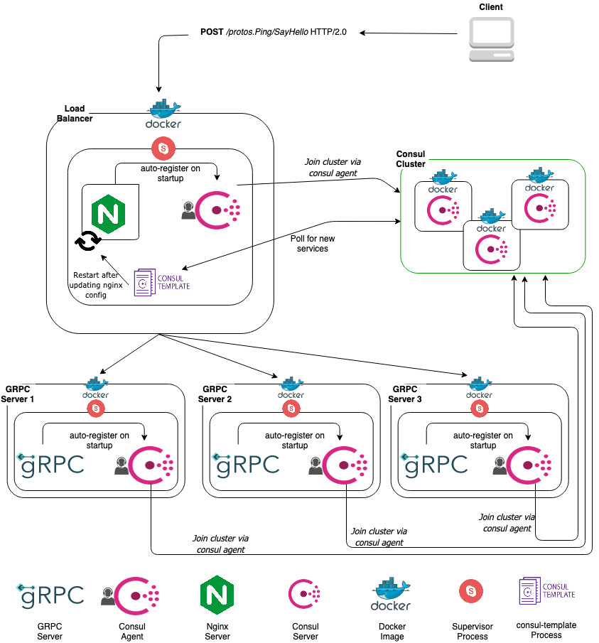

# GRPC Loadbalancing with Docker, Consul and Nginx 

This repo is heavily inspired by [this](https://hectormartinez.dev/posts/load-balancing-consul-nginx/) 
article by Hector Martinez.

# How it works



The overall architecture comprises of 8 different components in the following hierarchy:

1. Docker Container
    1. Consul Server
    2. Supervisor Process
        1. Consul Agent
        2. Register Process
        3. Nginx Server
        4. Consul Template Process
        5. GRPC Server

## Docker Container

The dockerfiles are contained in the `build/dockerfiles` folder of this repository.
There are 2 docker files being maintained:

1. Dockerfile.lb : This is the docker file used to build the image of the loadbalancer.
2. Dockerfile.grpc : This is the docker file used to build the image of the GRPC server.

Both these configs are multistage builds where the final image used is `alpine`.

### Consul Server

Three consul servers are leveraged in running the consul cluster. Thus, making it highly available.

It is used to maintain the list of services that are running in the docker-compose cluster.
i.e. it acts as the *service discovery component* of this architecture.

It makes use of the consul image available in dockerhub.

### Supervisor Process

For every docker container outside of the consul cluster, we need to run multiple processes in parallel. 
Hence, supervisord was the tool employed to make this happen.

All the below components are run as supervisord processes.

#### Consul Agent

The consul agent is run as a process for every docker container outside the consul cluster itself. 
This process acts as a conduit to register the docker container as a service with the consul cluster.

#### Register Process

This is a standalone HTTP client written in Golang which will allow you to register a server with the consul 
cluster via the consul agent running in the same docker container.

It makes use of the `/v1/agent/service/register` API exposed by the consul server to register the service.

#### Nginx Server

The Nginx server is used as a GRPC loadbalancer. It makes use of the `/etc/nginx/conf.d/load-balancer.conf` 
file to figure out the upstream services available to it.
 
#### Consul Template Process

This is used to query the consul cluster for the services available and write the results to the file system.
In our case, we write the results to the `load_balancer.conf` in the `/etc/nginx/conf.d/` folder.

This is included in the main `nginx.conf` file in the location `/etc/nginx/nginx.conf`. 

Consul template is run as a system process by supervisord by making use of the conf file 
`/etc/supervisor/conf.d/consul-template.conf`.

The command used in this conf first writes the results of the consul server to the 
location `/etc/nginx/conf.d/load-balancer.conf` by using the template `/etc/consul-templates/load-balancer.tpl`.

After this write is done, the nginx process is restarted by supervisord using the command `supervisorctl restart nginx`.
Thus resulting in loadbalancer being updated with the correct upstream servers.

To understand the frequency of the consul template process, please refer to 
[this](https://github.com/hashicorp/consul-template#running-and-process-lifecycle).

#### GRPC Server

The GRPC server being employed here is a simple server with a single method `/protos.Ping/SayHello` 
which responds with a simple greeting to the client.

## Deployment

### 1. Building Docker Images

#### Load Balancer

`docker build -t lb -f build/dockerfiles/Dockerfile.lb .`

#### GRPC Server

`docker build -t server -f build/dockerfiles/Dockerfile.grpc .`

### 2. Docker Compose Deployment

#### To start up the cluster, use:

`docker-compose up -d`

#### To scale the GRPC server, use:

`docker-compose up -d --scale hello_server=<number of replicas>`

eg.

`docker-compose up -d --scale hello_server=5`

This scales the GRPC server to use 5 replicas which will be automatically discovered by consul.

The consul-template CLI running as a daemon in the LB docker image will pull these services and 
update the `load_balancer.conf` in the `/etc/nginx/conf.d/` folder.

It will then restart the nginx server by using the command:

`supervisorctl restart nginx`

Thus resulting in the load balancer now routing traffic to the newly created replicas as well without 
any further manual steps.

#### Cluster Monitoring and Entrypoints

The cluster has only 2 entry points:

1. The `5000` port of the Nginx loadbalancer.
2. The `8500` port of the consul UI docker container.

To view the Consul UI and observe all the services running in the cluster, open `http://localhost:8500/ui/dc1/services`.

To send requests to GRPC servers, make requests to the `5000` port of the Nginx LB. 

## Repository Structure

```text
|-- README.md
|-- build
|   |-- config
|   |   |-- consul
|   |   |   |-- consul-template.conf
|   |   |   |-- consul.conf
|   |   |   |-- load-balancer.tpl
|   |   |   `-- root
|   |   |       |-- etc
|   |   |       |   |-- consul
|   |   |       |   |   `-- conf.d
|   |   |       |   |       `-- bootstrap
|   |   |       |   |           `-- config.json
|   |   |       |   |-- cont-init.d
|   |   |       |   |   |-- 30-consul
|   |   |       |   |   `-- 40-consul
|   |   |       |   `-- services.d
|   |   |       |       |-- consul
|   |   |       |       |   `-- run
|   |   |       |       `-- resolver
|   |   |       |           `-- run
|   |   |       `-- usr
|   |   |           `-- bin
|   |   |               |-- consul-available
|   |   |               |-- consul-debug
|   |   |               |-- consul-join
|   |   |               |-- consul-join-wan
|   |   |               |-- consul-node-id
|   |   |               `-- container-find
|   |   |-- nginx
|   |   |   |-- default.conf
|   |   |   `-- nginx.conf
|   |   `-- supervisord
|   |       |-- grpc_server.conf
|   |       |-- register.conf
|   |       |-- supervisor-nginx.conf
|   |       `-- supervisord.conf
|   `-- dockerfiles
|       |-- Dockerfile
|       |-- Dockerfile.grpc
|       `-- Dockerfile.lb
|-- docker-compose.yaml
|-- go.mod
|-- go.sum
|-- grpc_client
|   `-- main.go
|-- grpc_server
|   `-- main.go
|-- protos
|   |-- api.pb
|   |-- api.pb.go
|   |-- api.proto
|   `-- api_impl.go
`-- registrar
    `-- main.go
```

### Root Directories

#### protos

This folder contains the proto files used to determine the service interaction contract with the GRPC server.
To learn more about how protobufs are leveraged to do this, please refer to [Google's official documentation](https://developers.google.com/protocol-buffers/).

#### grpc_server

This folder contains the source code for the GRPC server.
It will listen on the port `7777`.

#### grpc_client

This folder contains the source code for the GRPC client.
It will try to communicate with the GRPC server based on the `-port` flag.

To run the client, please use this command:

`go run grpc_client/main.go -port=5000`

The response will be:

`Hello from 1b40646880d9.`

The "1b40646880d9" here, is the hostname of the GRPC server.

#### registrar

This folder contains the source code for the consul client which will auto-register a service.
It is written in Golang.

It will try to register the service into the local Consul agent 10 times, after that it will stop.
A simple PUT requests to the `/v1/agent/service/register` API of Consul, passing the correct payload.
To run the script, you need to set the following ENV vars:

```
export APP_NAME=fake_service
export APP_PORT=5001
export CONSUL_PORT=8500
export TAGS=svc1,grpc_server

go run register/main.go
```

Description for the env vars are as follows:

* `APP_NAME`: Name of the app being registered
* `APP_PORT`: Port on which the app is running
* `CONSUL_PORT`: Port on which consul is running. (Usually 8500)
* `TAGS`: Tags to be used to signify the app

Additionally, there are 2 optional env vars where you can specify the health check API details for the service:

* `HEALTH_CHECK_TYPE`: Can be "http" or "grpc"
* `HEALTH_CHECK_ENDPOINT`: API endpoint for the health check.

Documentation for consul health checks and how they can be leveraged can be found [here](https://www.consul.io/api/agent/check#register-check).

#### build

This directory contains the configs for the different tool we will be using inside the `/config` subfolder. Namely:

* [Consul](https://www.consul.io/) - Consul is a service networking solution to automate network configurations, discover services, and enable secure connectivity across any cloud or runtime.
* [Nginx](https://www.nginx.com/) - Nginx, stylized as NGINX, nginx or NginX, is a web server that can also be used as a reverse proxy, load balancer, mail proxy and HTTP cache.
* [Supervisord](http://supervisord.org/) - Supervisor is a client/server system that allows its users to monitor and control a number of processes on UNIX-like operating systems.
* [Consul Template](https://github.com/hashicorp/consul-template) - This project provides a convenient way to populate values from Consul into the file system using the consul-template daemon. It's used to keep repopulating nginx config with the services running and then restarting nginx.

The `/dockerfiles` folder contains the docker files needed to build the docker images being leveraged by the `docker-compose.yaml` file.
